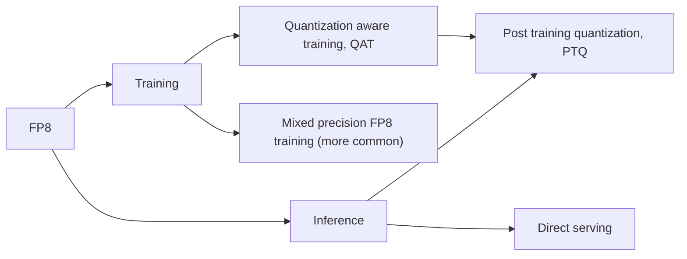
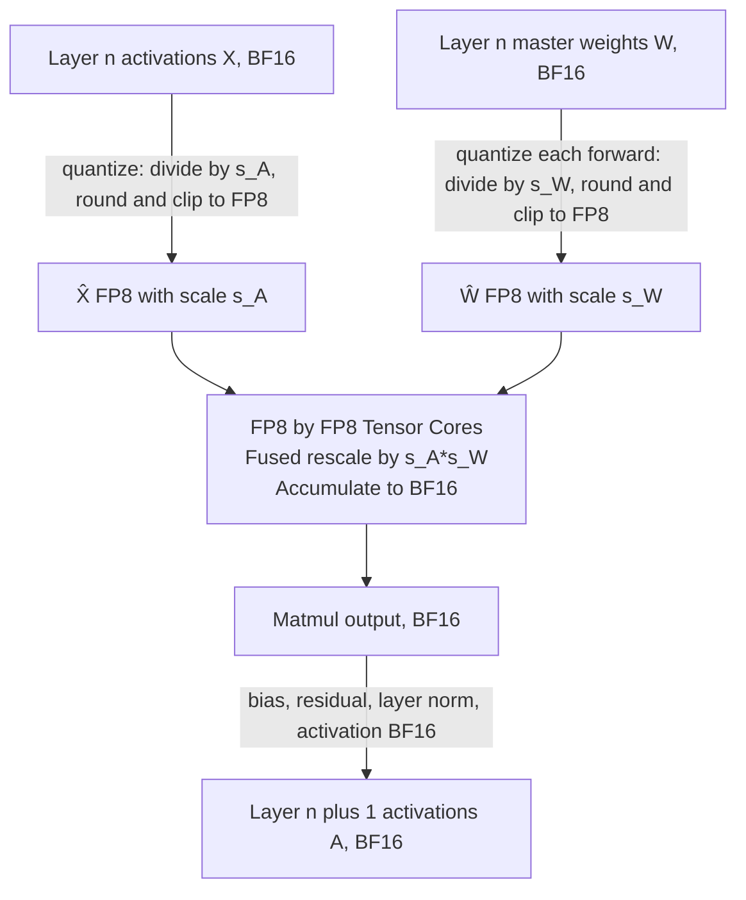

I am writing this to understand the role of FP8 datatype in [Systems for LLM](/_posts/2025-06-07-Systems-llm.md).  To follow along, you should have a basic understanding of transformer architectures, memory-bound vs compute-bound workloads, and GPU architecture fundamentals.

## FP8 in deep learning

There are already good references[^1] to get a quick overview of the FP8 datatype. Essentially, FP8 datatype stores data in 8 bits, cutting down the memory requirement by 2x in comparison to BFloat16 (BF16), which is currently the most popular datatype in which LLMs are trained and served. FP8 datatype comes in different formats, E4M3 (higher precision, smaller range) and E5M2 (lower precision, larger range), which serve different use cases. The details of the data type are mentioned in the paper[^2].

With newer chips (eg, FP8 support in NVIDIA Hopper GPUs and micro-scaled FP data formats support in Nvidia Blackwell GPUs), the FP8 datatype is becoming increasingly popular for both training and serving models. Here's an overview of different techniques where the FP8 datatype can be used for different deep learning workloads, training, and inference.

## FP8 for training and inference

Since the launch of Hopper GPUs, the FP8 has been natively supported in tensor core operations. This means that we can multiply matrices with the FP8 datatype directly in tensor cores. The TFLOPS that H100 offers for FP8 is twice that of BF16 operations (3.9 TFLOPS vs 1.9 TFLOPS) [^3]. This helps in two ways:

1. Matrix multiplication operations (or GEMM kernels) in transformer networks are 2x faster when done in FP8 instead of BF16
2. Since the datatype consumes less memory, the memory transfers are 2x faster (from HBM to cache, or over the network)

While both of these advantages help, FP8 plays a different role in training and inference. Generally, the training workloads are compute-bound (with higher batch sizes) and the inferencing workloads are memory-bound (during the decoding stage). Using FP8 Tensor Cores during training can significantly reduce end-to-end time, since GEMM operations dominate compute cost. Similarly, if we assume that we have a model with FP8 weights, the inferencing would also be accelerated since the GPU will have to move 2x less amount of data (especially during the decode stage). Notice that for inferencing, to realize substantial benefits from the FP8 datatype, we need a model whose weights are in FP8. We can use BF16 weights and FP8 GEMM during inference, too, but that alone does not ensure that we would see speedups during inference, since the decoding stage, which usually dominates chat or agentic scenarios, is memory-bound. There is no such strict requirement for training. During the training workload, we can (and often do) start with a higher precision datatype (eg, BF16) and use FP8 in certain operations during training.

One would assume to get a 2x speed improvement across the board. However, reality is not that simple. The next few sections explain why.

## FP8 training

In the training workload, we can think of using lower bit datatype in two scenarios

1. Native FP8 training
2. Quantization aware training (QAT)

But before we discuss the training flow, we need to understand how the higher precision values are quantized to lower precision.

### Quantizing to FP8

Quantization converts a BF16 tensor to FP8 by **scaling** its values so they fit within the representable FP8 range. Mathematically, consider a tensor $X$ in BF16 data type:  

1. Scale factor, $s = \frac{\max \|X\|}{\beta_{\mathrm{FP8}}}\$, where $\beta_{\mathrm{FP8}}\$ is the maximum magnitude that FP8 can represent.
2. Scaled tensor (still in BF16), $Y = \frac{X}{s}\$
3. FP8 scaled tensor, $\widehat{X} = \mathrm{clip}(\mathrm{round}_{\mathrm{FP8}}(Y))$, where we first round the scaled tensor $Y$ and then clip the resultant in the representable range of FP8

First, we have to decide our encoding strategy. How should we compute the scale factor? There are two ways:

1. Current (or online) scaling: Calculate the scale factor for every tensor every time it is quantized. This incurs a significant overhead since it is a necessary step to be done *before* we run the actual matrix multiplication
2. Delayed scaling: Instead, we can store the history of max values of the tensor in a buffer (amax history) and use the running average as the scale factor. In delayed scaling, the FP8 operator uses a scaling factor as well as emits a new scaling factor that is used to update the amax history. Both of these can happen asynchronously and hence incurs a lesser overhead than online scaling.

Second, we have to decide, what values to use for the scale:

1. Per tensor: Use the complete tensor to calculate the scale factor. A single tensor has a single scale factor associated with it.
2. Column-wise or row wise: Calculate a single scaling factor per column (or row). A single tensor has multiple scaling factors associated with it and separately stored. This is slower than per tensor scaling but results in better numerical stability. For example, for a MxK tensor, with column wise scaling, we would have K scales calculated and stored in FP32.
3. Block wise: Calculate a single scaling factor for different blocks of the tensor. This can be two dimension (eg: 128x128) or one dimensional (eg: 1x128). For example, for a 512x512 tensor, with (128x128) block scaling, we would have a 4x4 scaling tensor stored in FP32. Column wise (or row wise) scaling is a special case of block wise scaling where one dimension is equal to the number of columns (or rows).

Both of the above scaling techniques are orthogonal and can be mixed into a recipe. For example, using delayed scaling with block wise scales or using online scaling with per tensor scales. With the release of blackwell GPUs, NVIDIA released support for microscaling format (MX), i.e MXFP8, MXFP4, MXFP6, and MXINT8. MX formats are a special case of block wise scaling where the scales are calculated for a block of 1x32 and stored in FP8 (E8M0 format). Blackwell GPUs support MXFP8 datatypes natively, which means, they compute the scales inside the GEMM path which is much faster than calculating the scale factor manually in software. A similar setup can be emulated on Hopper GPUs as well, but must be handled in the software stack by the user which adds a significant overhead.  

Figure: (Left) Per tensor scaling vs (Right) MXFP8 scaling.

Figure: A single block of MXFP8 with 32 values and a single scale factor stored with them

### Native FP8 in training

When I first started reading about the FP8 datatype during training, my initial naive thought was that we could just initialize the weights in the FP8 datatype and start the training, where all the model parameters, like weights, activations, gradients, and optimization states, could use the FP8 datatype.  

However, since the range of FP8 is so small, it is not suitable to represent extremely large or small values without rounding to `inf` or 0. For example, in E4M3 format of FP8, the smallest positive value that it can store is ~0.0019 [^4]. Any tensor value smaller than this gets rounded to 0. This is problematic given that gradients can be very small, and optimizer states also need to store very small values. Even if we take a pretrained model that has its weights stored in BF16 and convert it to FP8 naively, a lot of the weights can become 0. This also means that if model parameters were updated directly in FP8, many small updates could be lost due to rounding to 0.

Due to this, in practice, usually the optimizer states are stored in higher precision datatypes like BF16 or FP32. The weights are also maintained in higher precision like BF16 called the master weights. After the backward pass, the optimizer updates the master weights, which are then quantized to FP8 for the next forward pass. During dequantization, we need the scale factor $s$ to get back the original value. For a deep dive into different quantization schemes, refer to the [visual guide to quantization](https://newsletter.maartengrootendorst.com/p/a-visual-guide-to-quantization). The quantization process comes with an overhead. This overhead dominates runtime at smaller matrix sizes but as the matrix sizes increase, the overhead is tiny in comparison to the actual matmul operation[^5].

Coming back to training, during the forward pass the activations ($X$) and weight matrix ($W$) are quantized to FP8. After that, both matrices are multiplied using tensor cores (handled by GEMM kernels). The accumulation of the output happens in a higher precision (either BF16 or FP32). The final result requires multiplying the output of GEMM by the scale factors of the input. This means we need to store the scale factors separately.

Instead of offloading all the operations to FP8, typically only matrix multiplications that dominate the training time, are offloaded to FP8. This is because, other operations are very sensitive to the lower range and precision of FP8 and can lead to very high accuracy loss if done in FP8.

Overall, there are a lot of interesting design choices [^6] that can be made during training:

1. The weights can be either replicated and stored as master weights in BF16, or quantized and stored to FP8 throughout the training run
2. The gradients for the backward pass can either be kept in BF16 and quantized to FP8 on the fly or completely kept in FP8
3. The optimizer states are almost always stored in FP32 or BF16, but some frameworks allow users to even quantize them to FP8
4. For distributed training, the weights may be quantized to FP8 before collective ops like all-gather to cut communications

FP8-LM [^8] from Microsoft explores multiple different ways FP8 can be integrated during training

1. They use FP8 for storing gradient values
   1. They use an adaptive scaling ($\mu$) factor for gradients. This factor gets updated based on the proportion of gradient values underflowing or overflowing.
   2. For distributed runs, they propose post-scaling of gradients where gradients from all ranks are first summed and then scaled
2. Master weights are stored in FP16 with per-tensor scaling and converted to FP8 for GEMM.
   1. > It reveals that the master weight is precision-sensitive. This can be attributed to the master weight’s role in updating weights, which tend to exhibit small magnitudes, necessitating high precision to maintain accuracy
3. Optimizer states are stored in FP8 (for magnitude) and FP16 (for direction).
   1. > This stems from the fact that, during model updates in Adam, the direction of the gradient holds greater significance than its magnitude.
4. Since FP8 parameters have a scale factor associated with them, the usual way of partitioning a tensor using NCCL primitives fails. They design novel ways of partitioning the tensor for distributed training.

Deepseek introduced various innovations in using FP8 for training in their Deepseek V3 paper [^9]:

1. GEMM uses FP8 input and BF16/FP32 accumulation and output (based on where it is used)
2. Activations are stored in FP8 that are reused in the backward pass. This reduces the activation memory that can dominate memory usage in large training runs
3. Some layers (embedding, LM head, moe routing layer, etc) still use BF16 GEMM
4. AdamW optimizer uses BF16 for both magnitude and direction, master weights are stored in FP32, and gradients are also stored in FP32
5. Block-wise scaling of weights (128x128) and activations (1x128). Since Deepseek V3 was trained on Hopper chips, they had to implement scaling manually. However, with Blackwell GPUs, block scaling can be handled natively
6. The accumulation pipeline is a bit convoluted for me to understand, but succinctly, accumulation is done in FP32 on CUDA cores, not Tensor Cores
7. Online scaling instead of delayed scaling
8. Activations before MoE up-projections are quantized to FP8 and then used for distributing across rank

|                  | FP32  | Mixed precision | BF16  | FP8 LM     | Deepseek v3 |
| ---------------- | ----- | --------------- | ----- | ---------- | ----------- |
| Weights          | 4M    | 2M+4M (FP32)    | 2M    | M+2M(FP16) | M+4M(FP32)  |
| Gradients        | 4M    | 2M              | 2M    | M          | 4M          |
| Optimizer states | 4M+4M | 4M+4M (FP32)    | 4M+4M | M+2M       | 2M+2M       |
| **Total**            | 16M   | 16M             | 12M   | 7M         | 13M         |
| Activation       | A     | A/2             | A/2   | A/4        | A/4         |
| **Reduction**        | 1x    | 1x              | 0.75x | 0.43x      | 0.81x       |

Table: The above table compares FP32 training, mixed precision training, native BF16 training, FP8 LM [^8], and Deepseek V3 [^9], considering a model with M parameters. The values are in bytes, expressed in terms of model parameters. The above is the peak memory usage during training. The table *(incorrectly)* assumes all operations in FP8, which is usually not the case.

*Recipes for Pre-training LLMs with MXFP8*[^11] provides yet another alternative on using MX formats.

1. It proposes to use the MXFP8-E4M3 format for all GEMM operations on Blackwell GPUs and does ablation studies proving the stability of training runs
2. They also propose a strategy to quantize (specifically, round to nearest) to FP8 from higher precision
3. Since the scaling is handled by the hardware, and is much more fine-grained (1x32 vs 1x128 used in Deepseek), MXFP8 results in better throughput and accuracy than native FP8
4. Attention operations, Softmax, embedding layer, and the final output projection layer still use higher precision (BF16).

In most implementations, FP8 GEMMs are used in FFN and some projection layers, but not in attention. *Towards Fully FP8 GEMM LLM Training at Scale* [^10] applies tweaks to the standard transformer architecture that enable applying FP8 GEMM to all the matmuls in the network. *Why Low-Precision Transformer Training Fails* [^12] goes into much more detail about why lower precision attention computations can be risky.

### Quantization aware training (QAT)

In QAT, we emulate quantization during training. This is helpful in cases where we want to quantize the model after the training is completed. Usually, in QAT, the actual matmuls happen in BF16. The training is setup such that the model learns to handle quantization post training which leads to minimal performance degradation. From a efficiency perspective, we don't see any benefits in training, so I will ignore this topic for the purpose of this blog.

## Inference

During inference, FP8 intgration is simpler. Narrower width of the datatype, consumes lesser memory and helps in memory bound operations. For example, a 24B model will take ~48G in BF16 datatype, but ~24G in FP8. This would result in having more memory for the KV cache and speedups in model weight movement from HBM to cache.

### Direct serving

If the model weights are already quantized (for example: GPT-OSS [^15] which is released in MXFP4 format), popular serving frameworks like vLLM or SGLang can serve the models directly without any additional steps. This enables better throughput during the decoding stage, and on newer generation GPUs, GEMMs also take advantage of the native lower precision format support like FP8 and MXFP8. On older generation GPUs, the memory transfer savings remain. However, since they cannot perform native FP8/MXFP8 GEMMs, the weights must be upcast to BF16 or FP16, which introduces some overhead. End-to-end gains are realized only when this casting overhead is smaller than the bandwidth savings from reduced memory transfer.

### Post training quantization  

PTQ takes a trained model (e.g, in BF16) and converts it to FP8 for inference. It involves 3 steps:

1. Calibration: Run a small, representative dataset through the original, high-precision model. During this step, the dynamic range (i.e., the minimum and maximum absolute values) of the activations is recorded.
2. Scale Calculation: Compute a fixed, static scaling factor for each tensor (per tensor or block-wise) based on those ranges.
3. Quantization & Storage: Use these static scales to convert the model's BF16 weights into FP8 weights. The final model stores both the quantized model and their corresponding scale factors.

Once the model weights are quantized to lower precision, the serving process is same as direct serving. During inference, both the weights and the corresponding scales are loaded to perform FP8 GEMMs.

> The choice of calibration dataset during PTQ is of high importance. See Section 4.1 of the [Sarvam-M release blog](https://www.sarvam.ai/blogs/sarvam-m) for more information

## Conclusion

FP8 for inference is usually straight-forward and easy to implement. It also leads to very minimal accuracy degradation ([^13], [^14]) and it's already popular in leading inference providers.

But why the heck is FP8 not popular in training workloads? Based on what I have read, my opinion is that we are in the very early phases of using FP8 for training. If I were to make an analogy, we are in the days of using mixed precision recipes of FP16+FP32. With the evolution of hardware, we slowly moved to native BF16 training. Slowly, with hardware advancements (eg: native support of micro scaling formats in Blackwell GPUs), software tricks ([^11], [^4]) and architectural tweaks [^10], we will move towards truly native FP8 training where 95%+ of the training time is spent in FP8.

We are not there yet!

## References

[^1]: [Floating-Point 8: An Introduction to Efficient, Lower-Precision AI Training](https://developer.nvidia.com/blog/floating-point-8-an-introduction-to-efficient-lower-precision-ai-training/)
[^2]: [FP8 formats for deep learning](https://arxiv.org/pdf/2209.05433)
[^3]: [H100 datasheet](https://resources.nvidia.com/en-us-gpu-resources/h100-datasheet-24306)
[^4]: [1.5x faster MoE training with custom MXFP8 kernels](https://cursor.com/blog/kernels)
[^5]: [Torchao Float8 benchmarks](https://github.com/pytorch/ao/blob/main/torchao/float8/README.md#performance)
[^6]: [Accelerate support for lower precision training](https://huggingface.co/docs/accelerate/en/concept_guides/low_precision_training#a-quick-chart)
[^7]: [Training and inference of large language models using 8-bit floating point](https://arxiv.org/pdf/2309.17224v1)
[^8]: [FP8-LM: Training FP8 Large Language Models](https://www.arxiv.org/pdf/2310.18313)
[^9]: [Deepseek V3](https://arxiv.org/abs/2412.19437)
[^10]: [Towards Fully FP8 GEMM LLM Training at Scale](https://arxiv.org/abs/2505.20524)
[^11]: [Recipes for Pre-training LLMs with MXFP8](https://www.alphaxiv.org/abs/2506.08027)
[^12]: [Why Low Precision Transformer Training Fails: An Analysis On Flash Attention](https://arxiv.org/abs/2510.04212)
[^13]: ["Give Me BF16 or Give Me Death"? Accuracy-Performance Trade-Offs in LLM Quantization](https://arxiv.org/abs/2411.02355)
[^14]: [FP8 inference in vLLM](https://developers.redhat.com/articles/2024/07/15/vllm-brings-fp8-inference-open-source-community)
[^15]: [gpt-oss-120b & gpt-oss-20b Model Card](https://arxiv.org/abs/2508.10925)
